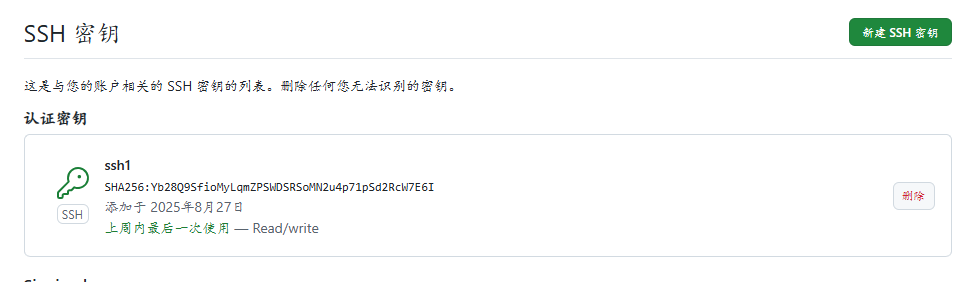

---
#frontmatter属性示例 详见:https://theme.sugarat.top/config/frontmatter.html
title: GitHub SSH密钥配置   #标题 ,不指定默认去文章的一级标题
description: github SSH密钥配置教程 #描述 text  不指定默认取文章内容前100字
sticky: 2 #用于设置在首页展示的 精选文章，值越大展示越靠前
top: 2 #用于设置在首页置顶展示的文章，从 1 开始，值越小越靠前
recommend: 1 #可用于配置左侧推荐列表数据表现，默认只展示同级目录下的文章
# publish: false #用于控制文章是否发布  等价于hidden: true recommend: false
---


# GitHub密钥配置

## 前言
昨天在搭建个人博客站点时,遇到github推送时出现ssh相关错误,折腾了几个小时才解决,所以在本文记录记录一下解决过程,以便后续再遇到此类问题时可以快速解决

## 错误及解决方法
### 错误
错误提示：`ssh: connect to host github.com port 22: Connection timed out fatal: Could not read from`  连接到主机github.com端口22：连接超时 致命错误：无法读取

### 解决方法
#### 1、检查网络连接
出现此问题先检查网络连接,如果有vpn代理检查一下vpn连接是否正常
#### 2、检查本机ssh配置是否正确
检查本机是否存在密钥

```shell
$ ls ~/.ssh
```

输入检查命令后如果本机存在ssh密钥对 id_rsa (私钥)、id_rsa.pub(公钥)那就代表之前生成过了,可以直接用之前生成过的,不想用可以删除之前的

```shell
$ ls ~/.ssh 
config  id_ed25519      id_rsa      known_hosts
csb/    id_ed25519.pub  id_rsa.pub  known_hosts.old
```

不想使用之前生成的命令可以删除

```shell
$ rm -rf ~/.ssh/id_rsa
$ rm -rf ~/.ssh/id_rsa.pub
```

如果不存在ssh密钥对,需要生成一个

```shell
$ ssh-keygen -t rsa -C "youremail@example.com"
```

```shell
#执行命令,将邮箱换为自己的
$ ssh-keygen -t rsa -C "youremail@example.com"
#执行命令后会弹出以下内容,这里输入回车就行
Enter file in which to save the key (/Users/dengzemiao/.ssh/id_rsa): 
# 输入验证密码，如果不想每次都输入验证密码，则直接回车，不进行输入
Enter passphrase (empty for no passphrase):
Enter same passphrase again:
```

生成后可以再输入检查命令,检查命令是否存在,存在的话可以执行以下命令复制公钥或者手动打开id_rsa.pub复制
```shell
$ cat ~/.ssh/id_rsa.pub
```

3、检查Github配置
github中打开【设置】-【SSH与GPG公钥】检查github ssh认证密钥是否存在,不存在的话点击新建,将本机生成的ssh 公钥也就是上面复制的公钥粘贴进去


[github ssh配置文档](https://docs.github.com/en/authentication/connecting-to-github-with-ssh/generating-a-new-ssh-key-and-adding-it-to-the-ssh-agent)


